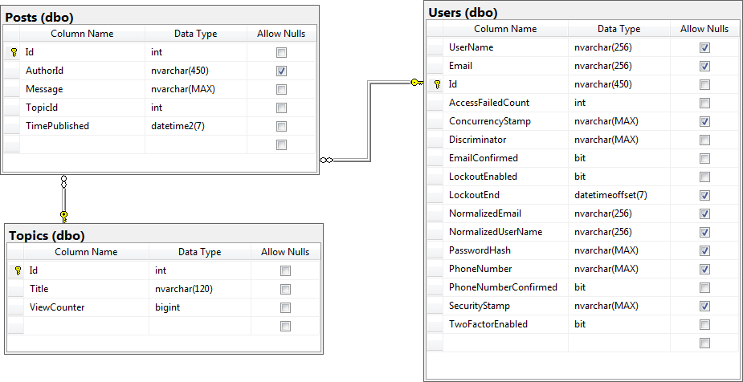

# Live Demo
Application is deployed at [this location](https://forumproject20200419124107.azurewebsites.net/)

Demo user credentials:
* johndoe:johnDoePassword1!
* sesame:openSeasame

#Entity Relationship Diagram

  

# Startup
In order to start the application you have to specify connection string for Microsoft SQL Server by environment variable __ConnectionString__.

You also have to specify SMTP parameters via environment variables:
* __EMAIL_FROM_ADDRESS__;
* __SMTP_PASSWORD__;
* __SMTP_ADDRESS__;
* __SMTP_PORT_NUMBER__.

I have used Gmail (SMTP_ADRESS = smtp.gmail.com, SMTP_PORT_NUMBER = 587).

Without it you will be able only to watch login and sign up pages, as sign in requires confirmed email.